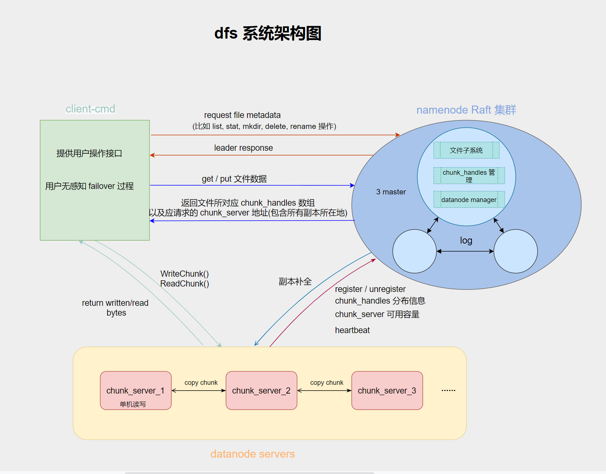

# DFS（简易的分布式存储系统）
### 项目总体架构
主要分为三大功能模块，客户端模块，元数据服务模块，存储引擎模块。
- 客户端负责提供用户操作的接口（比如 get,put，mkdir 等操作）以及文件分块操作（一
个 chunk 大小为 128kb）。
- 元数据模块采用 raft 协议保证一致性；通过文件目录树来维护元数据信息（文件名，
chunk_id，chunk 的存储位置），利用 leveldb 数据库来持久化元数据信息；还提供副本补全功能，自动扩容功能。
- 存储引擎模块实现了文件读写，多副本写，并持久化在磁盘上；实现了心跳机制以及向元数据模块上报信息（持有的 chunk_handles信息，chunk_Server可用容量等）

### 项目技术栈及功能
- 项目总体上采用C++开发。
- Client,Namenode,Datanode之间通过 Grpc进行通信。
- 数据在进??络传输、本地对象的持久化和加载到内存时，序列化协议采?protobuf。
- 多个Namenode之间通过 Raft 协议保证元数据的一致性。
- 通过文件目录树实现元数据信息维护，包括增删改查，维护读写锁，保证读写操作的原子性。
- 实现了丢失副本自动补全功能，保证数据的可靠性。
- 实现了自动扩容功能以及基本的负载均衡策略。
- 实现了存储引擎模块与元数据服务模块的心跳机制，以及存储引擎模块向元数据模块上报节点的相关信息。
- 实现了存储引擎模块的文件读写，多副本写，并且持久化在磁盘上。
- 通过 Leveldb 数据库实现持久化存储。
#### 几个核心问题
#####  NameNode集群
- 基本思路：根据Raft协议选举出Leader，Client向Leader结点发送请求，当leader写?相关操作的?志，并且通过?跳传递给Follower结点，Follower结点写??志后，返回成功标识，当?半以上的结点写?成功后，Leader写?到状态机中，返回成功给客?端，Follower收到下?次?跳的消息后，也应?到状态机中。
- 容错：如果是Follower宕机，此时如果仍然有?半以上的Follower结点，集群仍然可以正常运?；如果是Leader宕机，就需要重新选举新的Leader结点，选举成功后，继续提供服务。
##### 多副本写功能
- 我们这里的多副本写策略是：星型写。
（1）首先客户端会向元数据服务模块请求需要写入的 chunksever 的地址；
（2）元数据模块会给客户端一个数组，表示当前 chunk 需要写入的所有 chunkserver（3
个）。
（3）客户端将向第一个 chunksever（primary chunksever）中写入数据，然后由该
chunksever 将数据写到其他备份 chunksever 的节点上。
（4）等所有的 chunksever 都写入成功后，该 primary chunksever 才会返回给客户端写入成功。
##### 副本自动补全
- namenode 之间通过心跳机制探测 datanade 是否宕机，如果发现某个 chunkserver 宕机，也就是一段时间收不到该 chunkserver 的心跳。
（1）首先，master 首先会在元数据信息中查找出该 chunksever 所拥有的所有 chunk。
（2）其次，查找出 chunk 的其他副本所在的 chunkserver。
（3）最后，namenode 会下放写权限给包含该 chunk 的某个 chunksever（租约的机制），让其将该 chunk 备份一份到另一个的 chunksever 上（剩余容量最大）。从而始终保证 chunk 的副本数量为 3,并且任意两个相同的 chunk 不在同一个 chunksever上。
### demo结果展示
<video
src="http://www.w3school.com.cn/i/movie.mp4" controls=""
height=400 
width=600> 
</video>
